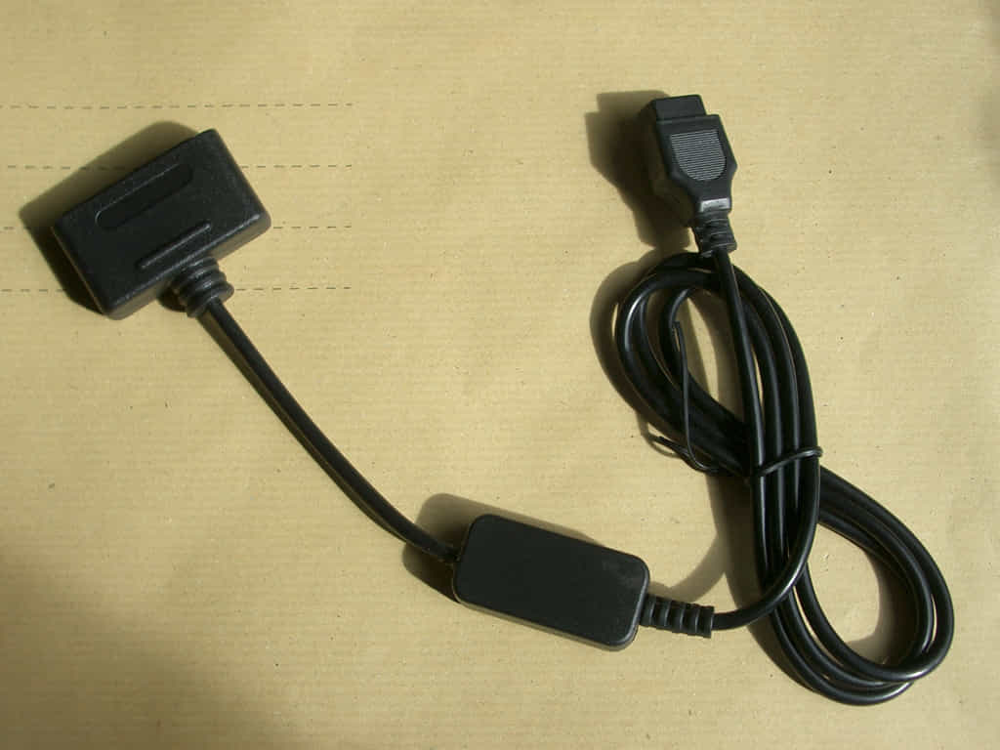
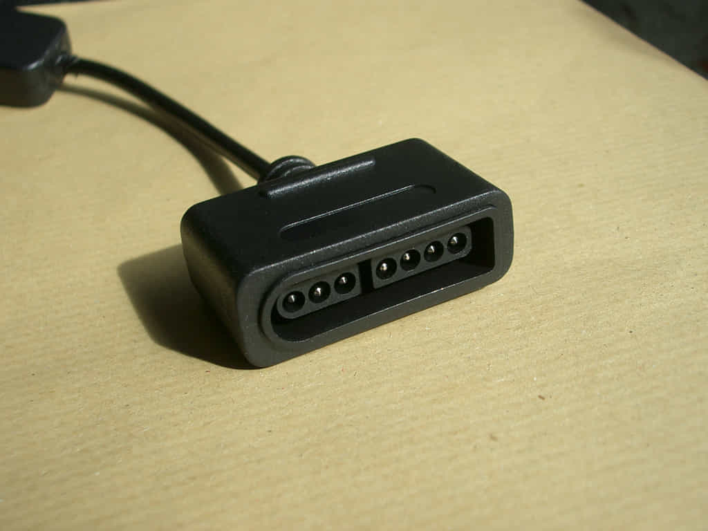
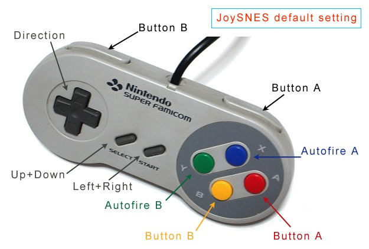

## Description

Here are stored [**patches**](https://www.msx.org/wiki/How_to_use_IPS_files) with documentation and utilities for the [**JoySnes**](https://www.msx.org/wiki/Popolon-fr_JoySNES) controller adapter. JoySnes allows you to use a Joypad or mouse for SNES ([**Super Nintendo Entertainment**](https://en.wikipedia.org/wiki/Super_Nintendo_Entertainment_System)) on MSX computer. This adapter adds features to the controller such as Auto-fire, swapping A-B buttons, button mirrors, settings save, Start button and Select button.

p

&copy; 2017 popolon-fr

