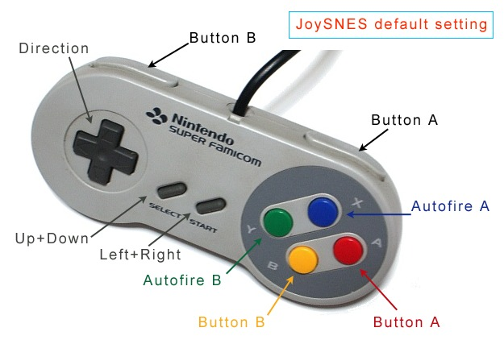
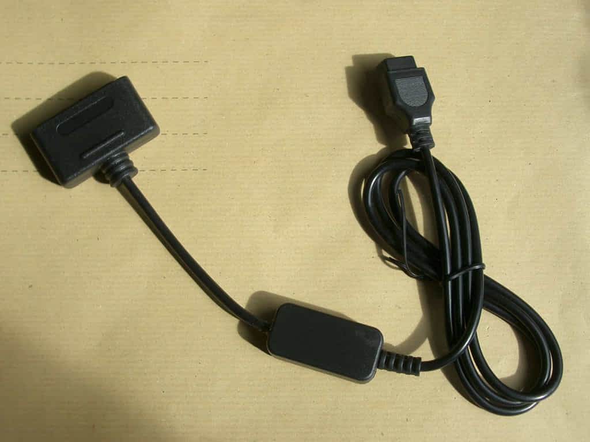
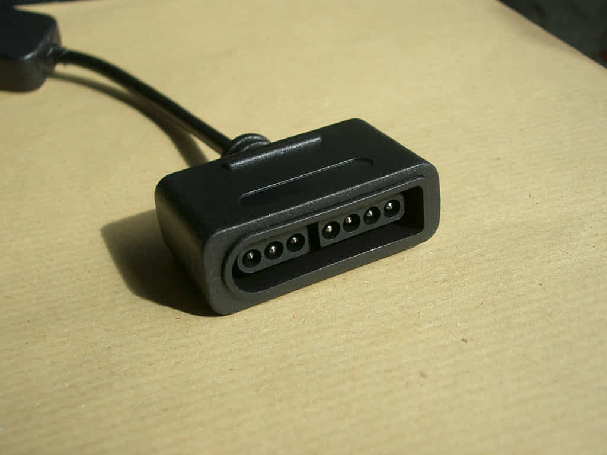

## Description

Here are stored [**patches**](https://www.msx.org/wiki/How_to_use_IPS_files) with documentation and utilities for the [**JoySnes**](https://www.msx.org/wiki/Popolon-fr_JoySNES) controller adapter. JoySnes allows you to use a Joypad or mouse for SNES ([**Super Nintendo Entertainment**](https://en.wikipedia.org/wiki/Super_Nintendo_Entertainment_System)) on MSX computer. This adapter adds features to the controller such as Auto-fire, swapping A-B buttons, button mirrors, settings save, Start button and Select button.

\_\_\_\_\_\_\_\_\_\_\_\_\_\_\_\_\_\_\_\_\_\_\_\_\_\_\_\_\_\_\_\_\_\_\_\_\_\_\_\_\_\_\_\_\_\_\_\_\_\_\_\_\_\_\_\_\_\_\_\_\_\_\_\_\_\_\_\_\_\_\_\_\_\_\_\_\_\_\_\_\_\_\_\_\_\_\_\_\_\_\_\_\_\_\_\_\_\_\_\_\_\_\_\_\_\_\_\_\_\_\_\_\_

###### **Description of the JoySnes button combinations on the SNES Joypad**

Pressing \[**`L`** + **`SELECT`** + **`START`**] simultaneously swaps \[**`L`** with **`R`**].

Pressing \[**`R`** + **`L`** + **`SELECT`** + **`START`**] simultaneously swaps \[**`Y`** with **`A`**].

###### **Version 1.3 and above**

Pressing \[**`R`** + **`SELECT`** + **`START`**] simultaneously swaps \[**`A`** with **`B`**] and swaps \[**`X`** with **`Y`**].

Pressing \[**`R`** + **`START`** + (*Directional pad*)] simultaneously to change the **autofire** speed.

* *Directional pad*:
  * \[**`DOWN`** ] : slow
  * \[**`LEFT`** ] : Medium
  * \[**`RIGHT`**] : Speed
  * \[**`UP`**   ] : More speed

Pressing \[ **`R`** + **`L`** + **`SELECT`** + **`X`**] simultaneously enters **EXTRA** mode.

Pressing \[ **`R`** + **`L`** + **`SELECT`** + **`X`**] simultaneously enters **DEFAULT** mode.

\_\_\_\_\_\_\_\_\_\_\_\_\_\_\_\_\_\_\_\_\_\_\_\_\_\_\_\_\_\_\_\_\_\_\_\_\_\_\_\_\_\_\_\_\_\_\_\_\_\_\_\_\_\_\_\_\_\_\_\_\_\_\_\_\_\_\_\_\_\_\_\_\_\_\_\_\_\_\_\_\_\_\_\_\_\_\_\_\_\_\_\_\_\_\_\_\_\_\_\_\_\_\_\_\_\_\_\_\_\_\_\_\_

&copy; 2017 popolon-fr

