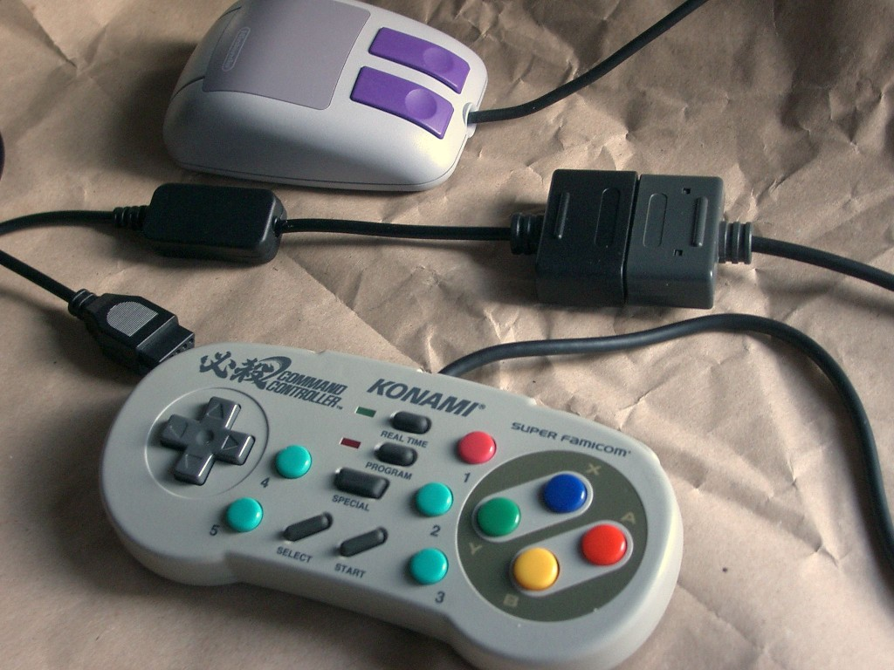
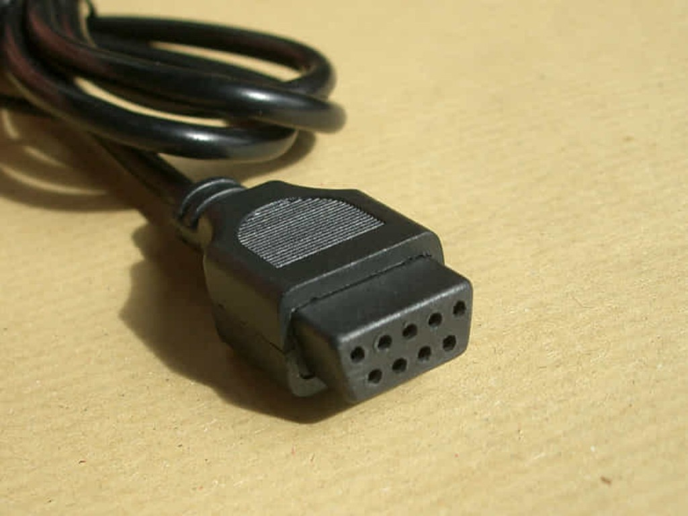

# 🎮 `JOYSNES`
 
 ## Description

Here are stored [**IPS**](https://www.msx.org/wiki/How_to_use_IPS_files) patches with documentation and utilities for the [**JoySnes**](https://www.msx.org/wiki/Popolon-fr_JoySNES) controller adapter. JoySnes allows you to use a Joypad or mouse for SNES ([**Super Nintendo Entertainment**](https://en.wikipedia.org/wiki/Super_Nintendo_Entertainment_System)) on MSX computer. This adapter adds features to the controller such as Auto-fire, swapping A-B buttons, button mirrors, settings save, Start button and Select button.

## Compatibility

It works on MSX, FM-Towns and X68000; however, the **EXTENDED** mode is currently only used on MSX, and there is no IPS patch for other machines.

---

---

## List of button combinations on the **SNES** controller
* **From version 1.0**
  * Press and hold **`X`** when switching on the machine enters **EXTENDED** mode.
  * Press and hold **`Y`** when switching on the machine enters **DEFAULT** mode.
  * Pressing \[**`L`** + **`SELECT`** + **`START`**] simultaneously swaps \[**`L`** with **`R`**].
  * Pressing \[**`R`** + **`L`** + **`SELECT`** + **`START`**] simultaneously swaps \[**`Y`** with **`A`**].

* **Version 1.3 and above**
  * Pressing \[ **`R`** + **`L`** + **`SELECT`** + **`X`**] simultaneously enters **EXTENDED** mode.
  * Pressing \[ **`R`** + **`L`** + **`SELECT`** + **`Y`**] simultaneously enters **DEFAULT** mode.
  * Pressing \[**`R`** + **`SELECT`** + **`START`**] simultaneously swaps \[**`A`** with **`B`**] and swaps \[**`X`** with **`Y`**].
  * Pressing \[**`R`** + **`START`** + (*Directional pad*)] simultaneously to change the **auto-fire** speed.
    * *Directional pad* :
      * **`DOWN`** : slow
      * **`LEFT`** : Medium
      * **`RIGHT`** : Speed
      * **`UP`** : More speed

**Note**: With each change, the state is retained. The buttons must be held down for approximately 3 seconds to validate the combination. For more details, consult the [**documentation**](https://github.com/popolonfr/JoySnes/blob/main/JoySNES%20Documentation.pdf).

---

---

&copy; 2017 popolon-fr

